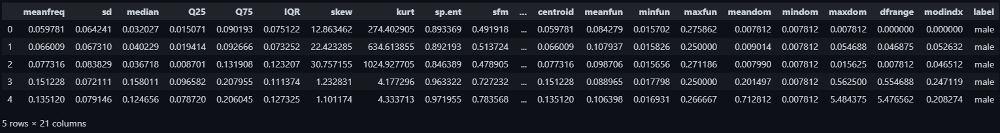

# Gender Voice Detection

In this project, we are predicting the Gender(Male or Female) through the Dataset having voice features. We are using Artificial Neural Network as a model for the Detection.

## Library Used:

* matplotlib.pyplot,
* tensorflow
* pandas
* numpy
* seaborn
* mglearn
* sklearn

## Overview of DataSet

)

Here, Label is the Dependent Variable which we have to predict.
